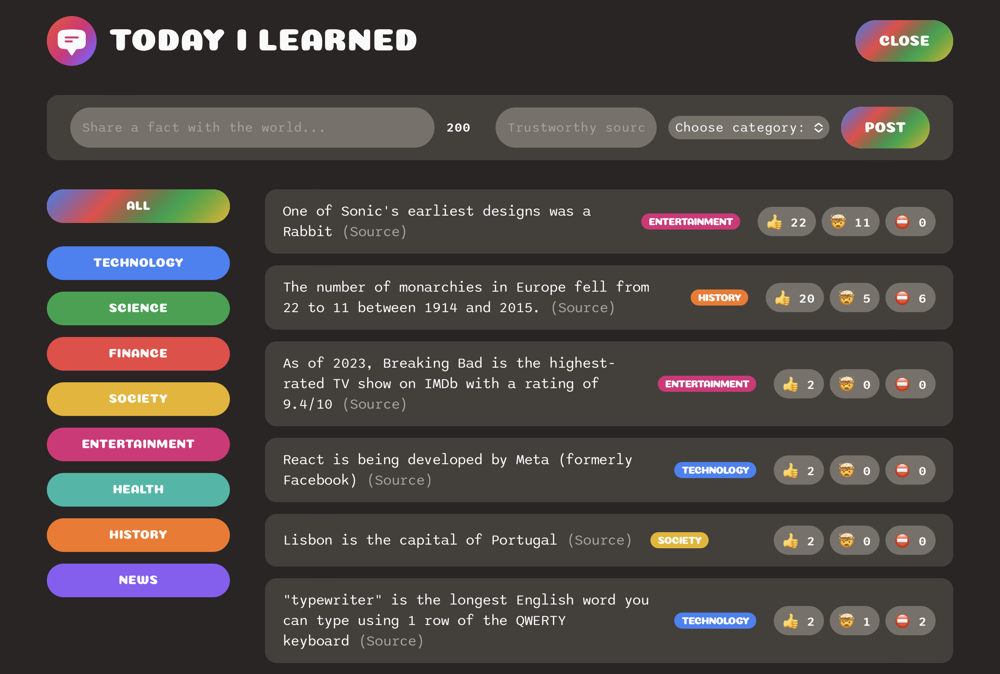

# Today I Learned App
This is a simple app that allows you to share facts you learned with others. It saves the facts in a database and displays them on the home page. It also allows users to vote on the facts they like. The facts with the most votes are displayed at the top of the home page. Users can also dispute facts they think are incorrect. Facts with more disputes than votes get a "disputed" label.

## Usage
 Click on the deployment link below to use the app. Use the " Share a fact" button to share a fact, add a source, choose a category and click the post button. You can also vote on facts you like, facts you find mindblowing and dispute facts you think are incorrect. 
 Facts can be filtered by category.

 ## Screenshot

## Deployment

https://2dayilearned.netlify.app/

## Built With

- React
- JavaScript
- CSS
- HTML
- Supabase
  
  ## Credits

  This app was the result of a Udemy course by Jan Schmedtmann. The course can be found here: https://www.udemy.com/course/full-stack-crash-course/
    

